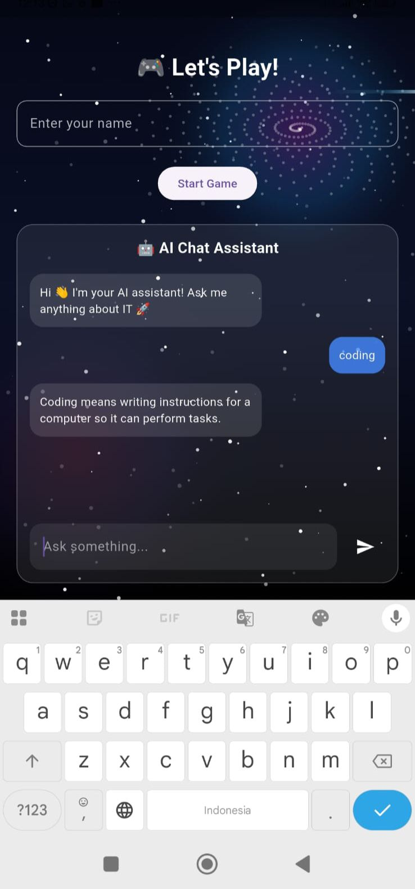
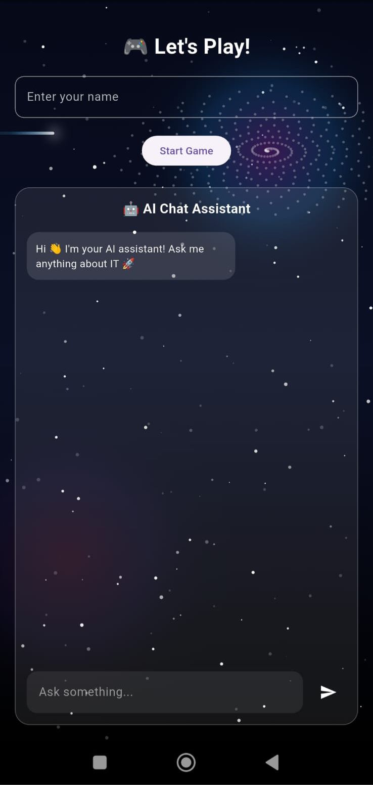
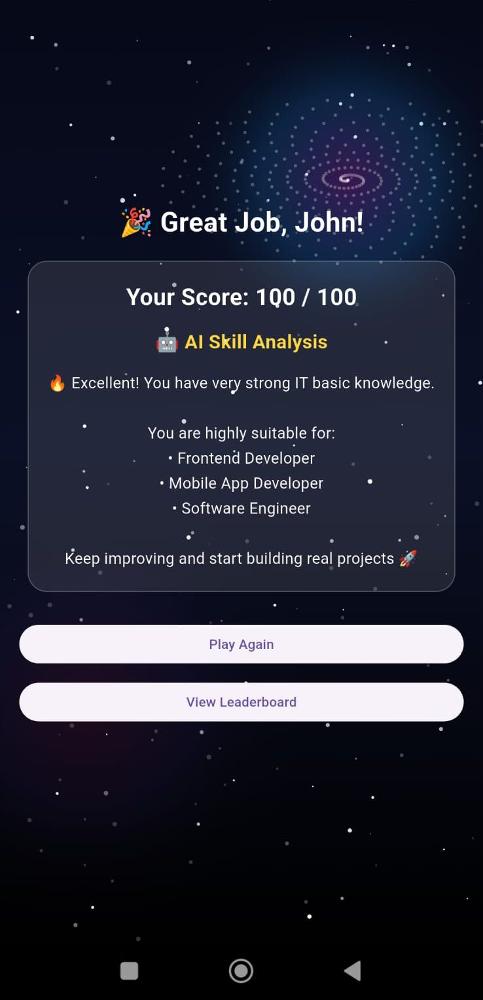
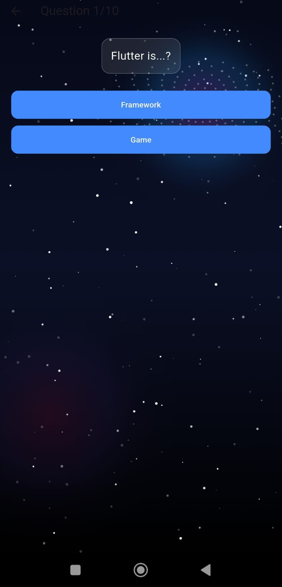

# Flutter AI Quiz App

This video showcases a Flutter mobile application developed as part of my portfolio for a Junior AI Engineer role at Elice Inc.

The app provides an interactive learning experience through an IT quiz system combined with a simple AI-powered chat assistant. It is designed to demonstrate both mobile development skills and basic AI integration.

## Features
- Interactive quiz system with scoring and feedback  
- AI chat assistant for answering fundamental IT questions  
- Responsive and user-friendly interface  

## Screenshots

 

## Demo Video
https://youtube.com/shorts/RELsiZtfrm4?feature=share

## Tech Stack
- Flutter (Dart)  
- Android SDK  

## Project Purpose
This project was built as part of my portfolio to demonstrate mobile development skills and basic AI integration for a Junior AI Engineer position.

## Author
Nadia
